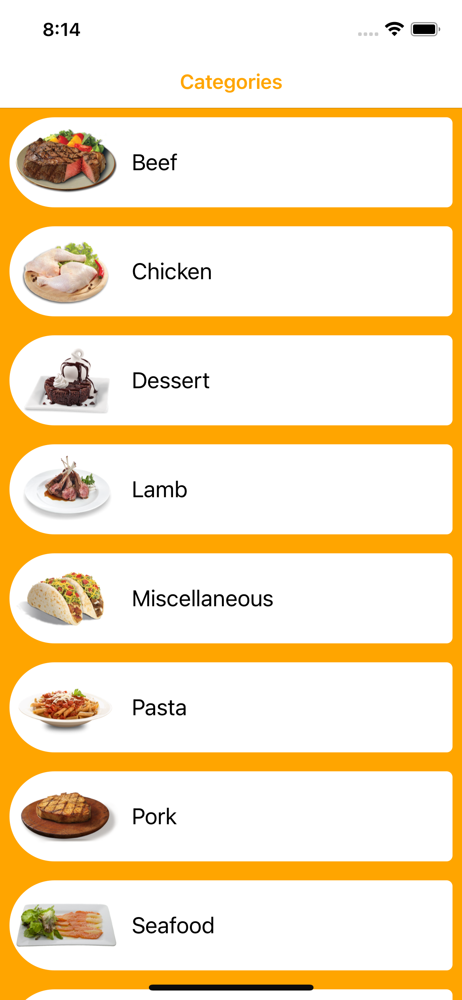
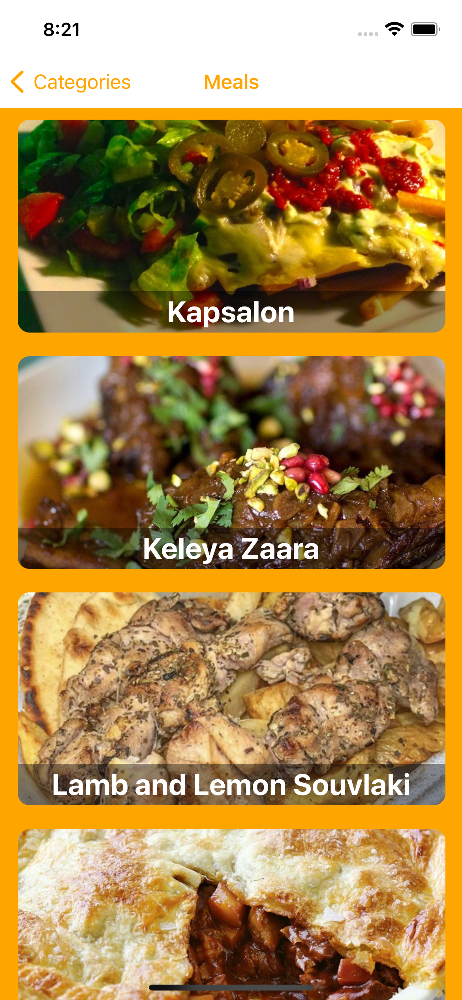
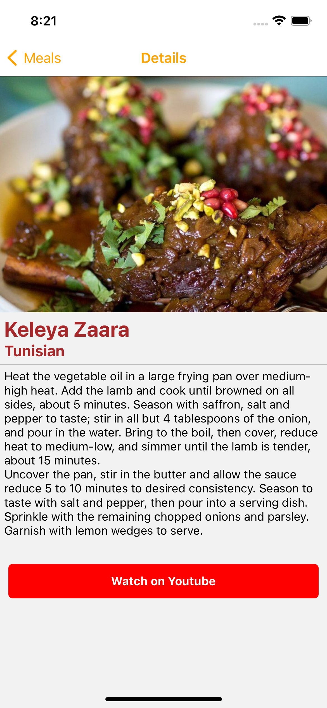

# Recipe App

  

## Setup

React Native: [Setting up the development environment](https://reactnative.dev/docs/environment-setup)

## Tools

- Custom Hooks
- React Navigation
- Lottie

## Features

- Listing returned categories with API.
- Listing the dishes belonging to the clicked category.
- Listing the details of the clicked dish.
- Showing loading screen until a response is returned from the API.
- Showing an error screen if a negative response is returned from the API.

## API

Used API : [TheMealDB](https://www.themealdb.com/api.php)

